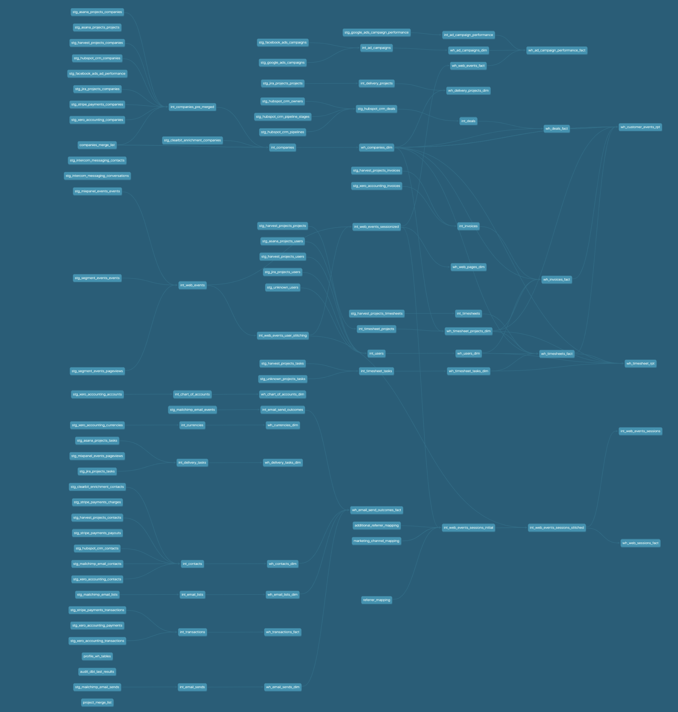

## Introduction

The RA Data Warehouse is a framework for ingesting, combining and restructuring data from multiple source systems into a conformed, dimensional data warehouse. The framework is based around dbt ("Data Build Tool"), open-source toolkit for templating and orchestrating SQL-based data transformations of RAW API-sourced data into structures suitable for analysis, and pre-built transformations and design patterns taken from Rittman Analytics' previous data warehousing consulting experience.

* [Rittman Analytics](https://rittmananalytics.com/home-index) homepage
* [Centralize and Connect your Data](https://rittmananalytics.com/data-centralisation) consulting packages
* [Rittman Analytics Blog dbt Posts](https://rittmananalytics.com/blog/tag/dbt)
* [Contact Us](https://rittmananalytics.com/home-index/#about-us)

[dbt](getdbt.com) is a toolkit that solves the problem of testing, repeatability and modularity of analysts code by bringing the principles of modern software development to the analysts' workflow. The RA Data Warehouse framework solves the problem of how to design your dbt transformations so that your project doesn't grind to a halt after you integrate your second, third, fourth data source because you need to combine identity across multiple systems, deduplicate multiple sources of customer data and make sure that numbers coming out of your BI tool still match with the numbers in your source systems.

* [Getting Started with dbt](https://rittmananalytics.com/getting-started-with-dbt) consulting packages
* [dbt Viewpoint](https://docs.getdbt.com/docs/about/viewpoint/)
* [dbtCloud](https://docs.getdbt.com/docs/dbt-cloud/cloud-overview) for scheduling and orchestrating dbt and the RA Data Warehouse

## Design Goals

1. For Rittman Analytics' team, to provide some standards around how we model and transform various data sources
2. To make it simpler to run data quality tests than to not, by defining these tests in-advance
3. To enable merging of customer, product, contact and other shared entity data with no single authoratitive source
4. To pre-create derived analytics measures for individual and combinations of sources
5. To create a means of selecting sources or subject areas ("modules") and have just those sources/modules loaded (and deployed for a customer)
6. To enable use of either Stitch, Fivetran or Segment as the pipeline technology based on client need
7. To enable loading and integration of custom (customer app database) sources into the warehouse

## Warehouse Design patterns

* [Dimension Merge and Deduplication Across Multiple Data Sources](https://github.com/rittmananalytics/ra_data_warehouse/blob/master/docs/merge_and_dedupe_pattern.md)
* [Selectable Data Sources and ETL Technologies](https://github.com/rittmananalytics/ra_data_warehouse/blob/master/docs/selectable_data_sources_pattern.md)
* [Separation of Source, Integration and Warehouse Layers](https://github.com/rittmananalytics/ra_data_warehouse/blob/master/docs/separation_of_source_integration_and_wh_layers_pattern.md)
* Replacing of all business keys with GUID primary keys
* Automatic post-load logging of ETL step row counts and outcomes (complete, error etc)

### Current Dimensional Model

### dbt Transformation Graph

## What Data Warehouse, Data Pipeline and Data Collection Technologies are Supported?

* Google BigQuery (Standard SQL)
* Stitch
* Fivetran (limited support)
* Segment (limited support)

## What SaaS Sources are Supported?

* Hubspot CRM (Stitch, Fivetran)
* Harvest Timesheets (Stitch)
* Xero Accounting (Stitch)
* Stripe Payments (Stitch)
* Asana Projects (Stitch)
* Jira Projects (Stitch)
* Mailchimp Email Marketing (Stitch)
* Segment Events (Segment)
* GCP Billing Exports
* Google Ads (Stitch)
* Facebook Ads (Stitch)
* Intercom Messaging (Stitch)
* Mixpanel Events (Stitch, Fivetran)
* Custom data sources

## What Warehouse modules are Modelled?

* Finance (Invoices, Chart of Accounts, Currencies)
* CRM (Deals, Contacts, Companies)
* Projects (Timesheet Projects, Timesheet Tasks, Delivery Projects, Delivery Tasks, Timesheets, Users)
* Marketing (Email lists, Email sends, Email campaigns, Ad Campaigns, Ad Performance, Web Page Views, Web Sessions)

## What Features and Other Support are on the Product Roadmap?

High-priority are:

* Extending Fivetran support to cover all remaining data source types
* Add support for incremental loading of warehouse tables
* Complete test coverage of warehouse and integration layer models

Medium-priority are:

* Extending Segment support to cover all appropriate remaining data sources
* Snowflake as an alternative to Google BigQuery as the warehouse platform
* Enrichment plugins

Issues and pull request from the community are welcomed!

## How Do We Setup a New Environment for Testing, Client Deployment?

See [Setting up a new Warehouse Environment](https://github.com/rittmananalytics/ra_data_warehouse/docs/blob/master/setup.md) for instructions on how to set-up a new warehouse environment
