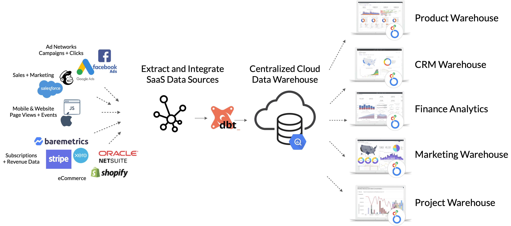
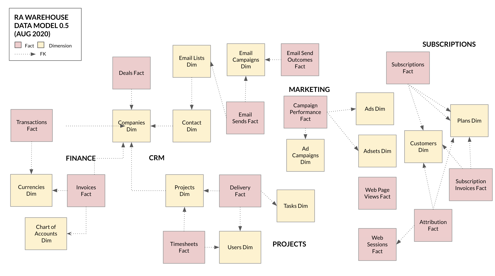
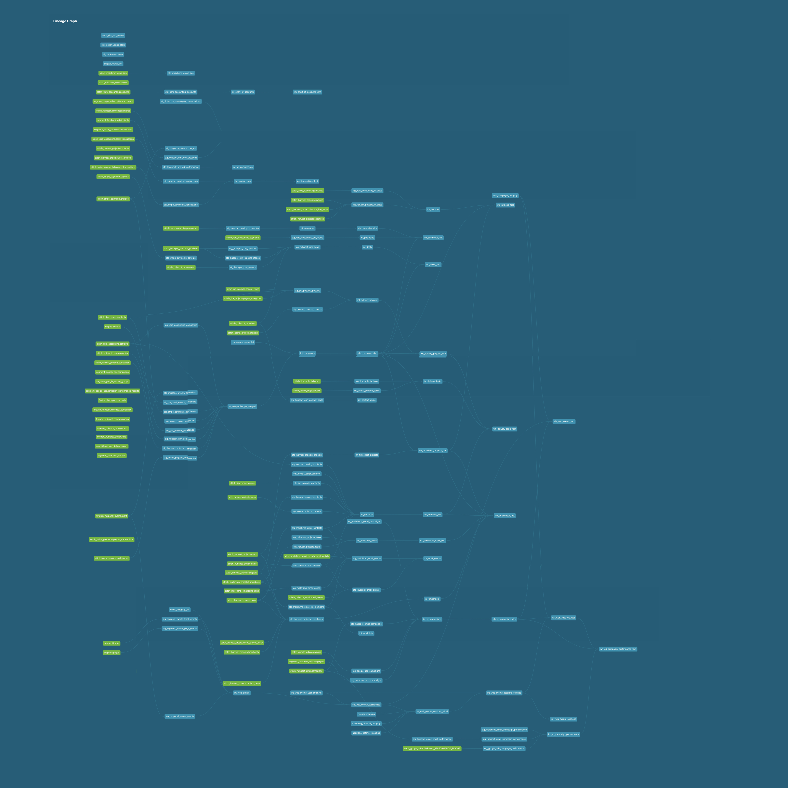

## Introduction

The RA Warehouse dbt framework is a set of data models, data transformations and data warehousing design patterns for use with dbt ("Data Build Tool"), an open-source data transformation and orchestration toolkit we use as the core set of models and transformations on all of our client projects.

The RA Warehouse dbt framework:

* Contains pre-built, standardised data source models for popular SaaS applications (Hubspot, Xero, Facebook Ads, Segment etc)
* Supports Stitch, Fivetran and Segment data pipeline services
* Works with both Google BigQuery and Snowflake data warehouse targets
* Combines and integrates data from multiple sources, deduplicates and creates single contact and company records
* Creates subject-area dimensional warehouses e.g. Finance, Marketing, Product, CRM
* Provides utilities for data profiling, ETL run logging and analysis
* Is configured through a set of variables in the dbt_project.yml file

We've open-sourced this framework to share our learnings and experience with the dbt and analytics engineering community, and to invite others to review, fork and hopefully contribute content back for others to use.



* [What's New in the v1.2.0 release](whats_new_in_v_1_2_0.md)

You can read more about our work with dbt, Google BigQuery, Snowflake and other modern data stack technologies on our website and blog:

* [Rittman Analytics](https://rittmananalytics.com/home-index) homepage
* [Data Centralization](https://rittmananalytics.com/data-centralization) consulting packages
* [Rittman Analytics Blog dbt Posts](https://rittmananalytics.com/blog/tag/dbt)
* [Contact Us](https://rittmananalytics.com/home-index/#about-us)

## Why Did We Create This Framework?

[dbt](getdbt.com) is a toolkit that solves the problem of testing, repeatability and modularity of analysts code by bringing the principles of modern software development to the analysts' workflow. The RA Data Warehouse framework solves the problem of how to design your dbt transformations so that your project doesn't grind to a halt after you integrate your second, third, fourth data source because you need to combine identity across multiple systems, deduplicate multiple sources of customer data and make sure that numbers coming out of your BI tool still match with the numbers in your source systems.

* [Getting Started with dbt](https://rittmananalytics.com/getting-started-with-dbt) consulting packages
* [dbt Viewpoint](https://docs.getdbt.com/docs/about/viewpoint/)
* [dbtCloud](https://docs.getdbt.com/docs/dbt-cloud/cloud-overview) for scheduling and orchestrating dbt and the RA Data Warehouse

## Design Goals

1. To provide standards for our team on how to structure, model and transform data for analysis
2. To enable merging of customer, product, contact and other shared entity data with no single authoratitive source
3. To provide fast time-to-value on client projects by pre-building and pre-integrating common SaaS data sources
4. To pre-create derived analytics measures for individual and combinations of sources
5. To create a means of selecting sources and warehouses and have just those sources/warehouses loaded (and deployed for a customer)
6. To support use of multiple warehouse platforms and combinations of extract technologies while maintaining a single code base
7. To make it simpler to run data quality tests than to not, by defining these tests in-advance
8. To enable loading and integration of custom (customer app database) sources into the warehouse

[Introducing the RA Warehouse dbt Framework : How Rittman Analytics Does Data Centralization using dbt, Google BigQuery, Stitch and Looker](https://rittmananalytics.com/blog/2020/5/28/introducing-the-ra-warehouse-dbt-framework-how-rittman-analytics-does-data-centralization) on the Rittman Analytics blog talks more about the background to this package.

## How Do We Use It?

Unlike most dbt packages this one isn't intended to be included in the packages.yml file of another, master package.

Instead, we typically clone or fork the entire repo when starting a new client project and then enable or disable data sources and targets as appropriate using the configuration settings in the dbt_project.yml file (see "Setup Steps" later in this readme)

Thereafter we typically extend and customise the data sources and warehouses already included in the package (submitting those changes back to the master repo if we think they'd be useful for other clients on subsequent projects), or we add new source modules, integration and warehouse models if they're not already in the framework (and again, publish them back to the master repo if they're generally applicable).

TODO: Add customization and extension guidelines


## What Data Warehouse, Data Pipeline and Data Collection Technologies are Supported?

* Google BigQuery (Standard SQL)
* Snowflake Data Warehouse
* Stitch
* Fivetran
* Segment

## What SaaS Sources are Supported?

* Hubspot CRM (Stitch, Fivetran)
* Hubspot Marketing (Stitch)
* Harvest Timesheets (Stitch)
* Xero Accounting (Stitch)
* Salesforce CRM (Stitch)
* Stripe Payments (Stitch)
* Stripe Subscriptions (Segment)
* Asana Projects (Stitch)
* Jira Projects (Stitch)
* Mailchimp Email Marketing (Stitch)
* Segment Events and Pageviews (Segment)
* GCP Billing Exports
* Google Ads (Segment, Stitch)
* Facebook Ads (Segment, Stitch)
* Intercom Messaging (Stitch)
* Mixpanel Events (Stitch, Fivetran)
* Baremetrics Analytics (Segment)
* Custom data sources

See [Compatibility Matrix](compatibility.md) for full details.

## What Warehouse modules are Modelled?

* Finance (Invoices, Chart of Accounts, Currencies)
* CRM (Deals, Contacts, Companies)
* Subscriptions (Plans, Subscribers, Subscriptions)
* Projects (Timesheet Projects, Timesheet Tasks, Delivery Projects, Delivery Tasks, Timesheets, Users)
* Marketing (Email lists, Email sends, Email campaigns, Ad Campaigns, Ad Performance, Ad Spend, Web Page Views, Web Sessions, Subscription Attribution)
* Product (Web Page Views, Web Sessions,)

## Design Approach

### Separation of Data Sources, Integration and Warehouse Module Layers

There are three distinct layers in the data warehouse:

1. A layer of source and ETL pipeline-specific data sources, containing SQL code used to transform and rename incoming tables from each source into common formats

2. An Integration layer, containing SQL transformations used to integrate, merge, deduplicate and transform data ready for loading into the main warehouse fact and dimension tables.

3. A warehouse layer made-up of subject area data marts, each of which contains multiple fact and conformed dimension tables


### Dimensional Model



### dbt Transformation Graph



### dbt Package Structure

dbt models inside this project are grouped together by these layers, with each data source "adapter" having all of its source SQL transformations contained with it.

```
├── analysis
├── data                      <-- "seed" files used for matching/merging companies, projects etc
├── macros
├── models
│   ├── integration           <-- "integration" models used to merge and dedupe models across multiple sources
│   ├── sources
│   │   ├── stg_asana_projects   <-- "source" models with data-source specific transformations and renaming of columns into common formats.
│   │   │   ├── bigquery         <-- target-specific folders containing SQL in correct format for BigQuery or Snowflake,
│   │   │   │   ├── stitch            enabled and disabled automatically by choice of target type in profiles.yml
│   │   │   ├── snowflake    
│   │   │   │   ├── stitch
│   │   ├── stg_custom_source_1             
│   │   ├── stg_custom_source_2            
│   │   ├── stg_facebook_ads 
│   │   │   ├── bigquery
│   │   │   │   ├── stitch         <--- stitch, segment or fivetran code enabled/disabled by reference to stg_XXXX_etl variables in dbt_project.yml
│   │   │   │   ├── segment
│   │   │   ├── snowflake    
│   │   │   │   ├── stitch              
│   │   ├── stg_gcp_billing_export         
│   │   ├── stg_google_ads
│   │   │   ├── bigquery
│   │   │   │   ├── stitch
│   │   │   │   ├── segment
│   │   │   ├── snowflake    
│   │   │   │   ├── stitch
│   │   ├── stg_harvest_projects
│   │   │   ├── bigquery
│   │   │   │   ├── stitch
│   │   │   ├── snowflake    
│   │   │   │   ├── stitch
│   │   ├── stg_hubspot_crm
│   │   │   ├── bigquery
│   │   │   │   ├── stitch
│   │   │   │   ├── fivetran
│   │   │   ├── snowflake    
│   │   │   │   ├── stitch
│   │   ├── stg_intercom_messaging
│   │   │   ├── bigquery
│   │   │   │   ├── stitch
│   │   ├── stg_jira_projects
│   │   │   ├── bigquery
│   │   │   │   ├── stitch
│   │   │   ├── snowflake    
│   │   │   │   ├── stitch
│   │   ├── stg_mailchimp_email
│   │   │   ├── bigquery
│   │   │   │   ├── stitch
│   │   │   ├── snowflake    
│   │   │   │   ├── stitch
│   │   ├── stg_mixpanel_events
│   │   │   ├── bigquery
│   │   │   │   ├── stitch
│   │   │   │   ├── segment
│   │   ├── stg_segment_events
│   │   │   ├── bigquery
│   │   │   │   ├── segment
│   │   │   ├── snowflake    
│   │   │   │   ├── segment
│   │   ├── stg_stripe_payments
│   │   │   ├── bigquery
│   │   │   │   ├── stitch
│   │   │   │   ├── segment
│   │   ├── stg_stripe_subscriptions
│   │   │   ├── bigquery
│   │   │   │   ├── stitch
│   │   │   │   ├── segment
│   │   ├── stg_unknown_values
│   │   └── stg_xero_accounting
│   │   │   ├── bigquery
│   │   │   │   ├── stitch
│   ├── utils                           <-- "utils" models, for example for row count logging
│   └── warehouse                       <-- "warehouse" models containing fact and dimension tables,
│       ├── w_crm                           grouped by subject area
│       ├── w_finance
│       ├── w_marketing
│       ├── w_product
│       └── w_projects
│       └── w_subscriptions
```

### Dimension Union and Merge Deduplication Design Pattern

Customers, contacts, projects and other shared dimensions are automatically created from all data sources, deduplicating by name and merge lookup files using a process that preserves source system keys whilst assigning a unique ID for each customer, contact etc.

1. Each set of dbt source module provides a unique ID, prefixed with the source name, and another field value (for example, user name) that can be used for deduplicating dimension members downstream. 

```
WITH source AS (
    {{ filter_stitch_relation(relation=var('stg_hubspot_crm_stitch_companies_table'),unique_column='companyid') }}
  ),
  renamed AS (
    SELECT
      CONCAT('{{ var('stg_hubspot_crm_id-prefix') }}',companyid) AS company_id,
      REPLACE(REPLACE(REPLACE(properties.name.value, 'Limited', ''), 'ltd', ''),', Inc.','') AS company_name,
      properties.address.value AS                   company_address,
      properties.address2.value AS                  company_address2,
      properties.city.value AS                      company_city,
      properties.state.value AS                     company_state,
      properties.country.value AS                   company_country,
      properties.zip.value AS                       company_zip,
      properties.phone.value AS                     company_phone,
      properties.website.value AS                   company_website,
      properties.industry.value AS                  company_industry,
      properties.linkedin_company_page.value AS     company_linkedin_company_page,
      properties.linkedinbio.value AS               company_linkedin_bio,
      properties.twitterhandle.value AS             company_twitterhandle,
      properties.description.value AS               company_description,
      CAST (NULL AS STRING) AS                      company_finance_status,
      cast (null as string)      as                 company_currency_code,
      properties.createdate.value AS                company_created_date,
      properties.hs_lastmodifieddate.value          company_last_modified_date
    FROM
      source
  )
SELECT
  *
FROM
  renamed
```

2. These tables are then initially unioned (UNION ALL) together in the i_* integration view, with the set of sources to be merged determined by the relevant variable in the dbt_project.yml config file:

```

crm_warehouse_company_sources: ['hubspot_crm','harvest_projects','xero_accounting','stripe_payments','asana_projects','jira_projects'

```

Unioning takes place using a Jinja "for" loop

```
with t_companies_pre_merged as (

    
      

      select
        '{{source}}' as source,
        *
        from {{ ref(relation_source) }}

        union all
      

    )
```

3. An CTE containing an array of source dimension IDs is then created within the int_ integration view, grouped by the deduplication column (in this example, user name)

```


  all_company_ids as (
             SELECT company_name, array_agg(distinct company_id ignore nulls) as all_company_ids
             FROM t_companies_pre_merged
             group by 1),
```

Any other multivalue columns are similarly-grouped by the deduplication column in further CTEs within the i_ integration view, for example list of email addresses for a user.

```
all_company_addresses as (
             SELECT company_name, array_agg(struct(company_address,
                                                   company_address2,
                                                   case when length(trim(company_city)) = 0 then null else company_city end as company_city,
                                                   case when length(trim(company_state)) = 0 then null else company_state end as company_state,
                                                   case when length(trim(company_country)) = 0 then null else company_country end as company_country,
                                                   case when length(trim(company_zip)) = 0 then null else company_zip  end as company_zip) ignore nulls) as all_company_addresses

```

If the target warehouse is Snowflake rather than BigQuery, this is detected through the target.type Jinja function and the functionally-equivalent Snowflake SQL version is used instead.

```


      all_company_ids as (
          SELECT company_name,
                 array_agg(
                    distinct company_id
                  ) as all_company_ids
            FROM t_companies_pre_merged
          group by 1),
      all_company_addresses as (
          SELECT company_name,
                 array_agg(
                      parse_json (
                        concat('{"company_address":"',company_address,
                               '", "company_address2":"',company_address2,
                               '", "company_city":"',company_city,
                               '", "company_state":"',company_state,
                               '", "company_country":"',company_country,
                               '", "company_zip":"',company_zip,'"} ')
                      )
                 ) as all_company_addresses

```

For dimensions where merging of members by name is not sufficient (for example, company names that cannot be relied on to always be spelt the same across all sources) we can add seed files to map one member to another and then extend the logic of the merge to make use of this merge file, for example when BigQuery is the target warehouse:

```


from companies_pre_merged c
       left outer join (
            select company_name,
            ARRAY(SELECT DISTINCT x
                    FROM UNNEST(all_company_ids) AS x) as all_company_ids
            from (
                 select company_name, array_concat_agg(all_company_ids) as all_company_ids
                 from (
                      select * from (
                          select
                          c2.company_name as company_name,
                          c2.all_company_ids as all_company_ids
                          from   {{ ref('companies_merge_list') }} m
                          join companies_pre_merged c1 on m.old_company_id in UNNEST(c1.all_company_ids)
                          join companies_pre_merged c2 on m.company_id in UNNEST(c2.all_company_ids)
                          )
                      union all
                      select * from (
                          select
                          c2.company_name as company_name,
                          c1.all_company_ids as all_company_ids
                          from   {{ ref('companies_merge_list') }} m
                          join companies_pre_merged c1 on m.old_company_id in UNNEST(c1.all_company_ids)
                          join companies_pre_merged c2 on m.company_id in UNNEST(c2.all_company_ids)
                          )
                 )
                 group by 1
            )) m
       on c.company_name = m.company_name
       where c.company_name not in (
           select
           c2.company_name
           from   {{ ref('companies_merge_list') }} m
           join companies_pre_merged c2 on m.old_company_id in UNNEST(c2.all_company_ids)
         ))
```

and if the target is Snowflake the following SQL is executed instead:

```


             left outer join (
                      select company_name, array_agg(all_company_ids) as all_company_ids
                           from (
                             select
                               c2.company_name as company_name,
                               c2.all_company_ids as all_company_ids
                             from   {{ ref('companies_merge_list') }} m
                             join (
                               SELECT c1.company_name, c1f.value::string as all_company_ids from {{ ref('int_companies_pre_merged') }} c1,table(flatten(c1.all_company_ids)) c1f) c1
                             on m.old_company_id = c1.all_company_ids
                             join (
                               SELECT c2.company_name, c2f.value::string as all_company_ids from {{ ref('int_companies_pre_merged') }} c2,table(flatten(c2.all_company_ids)) c2f) c2
                             on m.company_id = c2.all_company_ids
                             union all
                             select
                               c2.company_name as company_name,
                               c1.all_company_ids as all_company_ids
                             from   {{ ref('companies_merge_list') }} m
                             join (
                               SELECT c1.company_name, c1f.value::string as all_company_ids from {{ ref('int_companies_pre_merged') }} c1,table(flatten(c1.all_company_ids)) c1f) c1
                               on m.old_company_id = c1.all_company_ids
                               join (
                                 SELECT c2.company_name, c2f.value::string as all_company_ids from {{ ref('int_companies_pre_merged') }} c2,table(flatten(c2.all_company_ids)) c2f) c2
                               on m.company_id = c2.all_company_ids
                             )
                       group by 1
                  ) m
             on c.company_name = m.company_name
             where c.company_name not in (
                 select
                 c2.company_name
                 from   {{ ref('companies_merge_list') }} m
                 join (SELECT c2.company_name, c2f.value::string as all_company_ids
                       from {{ ref('int_companies_pre_merged') }} c2,table(flatten(c2.all_company_ids)) c2f) c2
                       on m.old_company_id = c2.all_company_ids)
```

4. Within the i_ integration view, all remaining columns are then deduplicated by the deduplication column.

```
SELECT user_name,
		MAX(contact_is_contractor) as contact_is_contractor,
		MAX(contact_is_staff) as contact_is_staff,
		MAX(contact_weekly_capacity) as contact_weekly_capacity ,
		MAX(user_phone) as user_phone,
		MAX(contact_default_hourly_rate) as contact_default_hourly_rate,
		MAX(contact_cost_rate) as contact_cost_rate,
		MAX(contact_is_active) as contact_is_active,
		MAX(user_created_ts) as user_created_ts,
		MAX(user_last_modified_ts) as user_last_modified_ts,
	FROM t_users_merge_list
	GROUP BY 1
```

5. Then this deduplicated CTE is joined-back to the CTE, along with any other multivalue column CTEs

```
SELECT i.all_user_ids,
        u.*,
        e.all_user_emails
 FROM (
	SELECT user_name,
		MAX(contact_is_contractor) as contact_is_contractor,
		MAX(contact_is_staff) as contact_is_staff,
		MAX(contact_weekly_capacity) as contact_weekly_capacity ,
		MAX(user_phone) as user_phone,
		MAX(contact_default_hourly_rate) as contact_default_hourly_rate,
		MAX(contact_cost_rate) as contact_cost_rate,
		MAX(contact_is_active) as contact_is_active,
		MAX(user_created_ts) as user_created_ts,
		MAX(user_last_modified_ts) as user_last_modified_ts,
	FROM t_users_merge_list
	GROUP BY 1) u
JOIN user_emails e 
ON u.user_name = COALESCE(e.user_name,'Unknown')
JOIN user_ids i 
ON u.user_name = i.user_name
```

5. The wh_ warehouse dimension table then adds a surrogate key for each dimension member.

```
WITH companies_dim as (
  SELECT
    {{ dbt_utils.surrogate_key(['company_name']) }} as company_pk,
    *
  FROM
    {{ ref('int_companies') }} c
)
select * from companies_dim
```

6. The i_ integration view for the associated fact table contains rows referencing these deduplicated dimension members using the source system IDs e.g. 'harvest-2122', 'asana-22122'

7. When loading the associated wh_ fact table, the lookup to the wh_ dimension table uses UNNEST() to query the array of source system IDs when the target is BigQuery, returning the company_pk as the dimension surrogate key

```
WITH delivery_projects AS
  (
  SELECT *
  FROM   {{ ref('int_delivery_projects') }}
),

  companies_dim as (
    SELECT {{ dbt_utils.star(from=ref('wh_companies_dim')) }}
    from {{ ref('wh_companies_dim') }}
  )
SELECT
	...
FROM
   delivery_projects p
   
     JOIN companies_dim c
       ON p.company_id IN UNNEST(c.all_company_ids)
```

Wheras when Snowflake is the target warehouse, the following SQL is used instead:

```

companies_dim as (
    SELECT c.company_pk, cf.value::string as company_id
    from {{ ref('wh_companies_dim') }} c,table(flatten(c.all_company_ids)) cf
)
SELECT 
   ...
FROM
   delivery_projects p

     JOIN companies_dim c
       ON p.company_id = c.company_id
```

8. The wh_ dimension table contains the source system IDs and other multivalue dimension columns as repeating columns for BigQuery warehouse targets and Variant datatypes containing JSON values for Snowflake.

## Automatic Data Profiling of Source, Integration and Warehouse Tables

One of the challenges when centralising data from a new source is how to efficiently audit the data it provides, and one of the most fundamental tasks in a data audit is to understand the content and structure of each of those data source tables. The data profiling feature within the RA Warehouse dbt Framework automates, for any schema (dataset) in BigQuery, production of the following audit information for every table or view column in that schema:

* Count of nulls, not nulls and percentage null
* Whether column is Not Nullable, and based on a configurable % threshold (default 90%) whether the column should be considered Not Nullable with nulls then classed as data errors
* Count of unique values and percentage unique
* based on a configurable % threshold (default 90%) whether the column should be considered Unique with duplicate values then classed as data errors
* Data Type
* Min, Max and Average values
* Most frequently occuring value, and count of rows containing most frequent value
* Whether column is used for partitioning


### How Does Data Profiling Work?

Data Profiling is based around a dbt macro that, for every view or table ("relation") in a given schema, generates an SQL query that creates a series of SQL query blocks that generate stats for each database object, unions those queries together and then joins the results to another query against the INFORMATION_SCHEMA.COLUMNS to obtain each object's metadata.

```


{{ config(schema='profiles') }}






SELECT column_stats.table_catalog,
       column_stats.table_schema,
       column_stats.table_name,
       column_stats.column_name,
       case when column_metadata.is_nullable = 'YES' then false else true end as is_not_nullable_column,
       case when column_stats.pct_not_null > {{ not_null_profile_threshold_pct }} then true else false end as is_recommended_not_nullable_column,

       column_stats._nulls as count_nulls,
       column_stats._non_nulls as count_not_nulls,
       column_stats.pct_not_null as pct_not_null,
       column_stats.table_rows,
       column_stats.count_distinct_values,
       column_stats.pct_unique,
       case when column_stats.pct_unique >= {{ unique_profile_threshold_pct }} then true else false end as is_recommended_unique_column,

       column_metadata.* EXCEPT (table_catalog,
                       table_schema,
                       table_name,
                       column_name,
                       is_nullable),
       column_stats.* EXCEPT (table_catalog,
                              table_schema,
                              table_name,
                              column_name,
                              _nulls,
                              _non_nulls,
                              pct_not_null,
                              table_rows,
                              pct_unique,
                              count_distinct_values)
FROM
(

  SELECT *
  FROM
(
  WITH
    `table` AS (SELECT * FROM {{ table }} ),
    table_as_json AS (SELECT REGEXP_REPLACE(TO_JSON_STRING(t), r'^{|}$', '') AS ROW FROM `table` AS t ),
    pairs AS (SELECT REPLACE(column_name, '"', '') AS column_name, IF (SAFE_CAST(column_value AS STRING)='null',NULL, column_value) AS column_value
              FROM table_as_json,UNNEST(SPLIT(ROW, ',"')) AS z,UNNEST([SPLIT(z, ':')[SAFE_OFFSET(0)]]) AS column_name,UNNEST([SPLIT(z, ':')[SAFE_OFFSET(1)]]) AS column_value ),
    profile AS (
    SELECT
      split(replace('{{ table }}','`',''),'.' )[safe_offset(0)] as table_catalog,
      split(replace('{{ table }}','`',''),'.' )[safe_offset(1)] as table_schema,
      split(replace('{{ table }}','`',''),'.' )[safe_offset(2)] as table_name,
      column_name,
      COUNT(*) AS table_rows,
      COUNT(DISTINCT column_value) AS count_distinct_values,
      safe_divide(COUNT(DISTINCT column_value),COUNT(*)) AS pct_unique,
      COUNTIF(column_value IS NULL) AS _nulls,
      COUNTIF(column_value IS NOT NULL) AS _non_nulls,
      COUNTIF(column_value IS NOT NULL) / COUNT(*) AS pct_not_null,
      min(column_value) as _min_value,
      max(column_value) as _max_value,
      avg(SAFE_CAST(column_value AS numeric)) as _avg_value,
      APPROX_TOP_COUNT(column_value, 1)[OFFSET(0)] AS _most_frequent_value,
      MIN(LENGTH(SAFE_CAST(column_value AS STRING))) AS _min_length,
      MAX(LENGTH(SAFE_CAST(column_value AS STRING))) AS _max_length,
      ROUND(AVG(LENGTH(SAFE_CAST(column_value AS STRING)))) AS _avr_length
    FROM
      pairs
    WHERE
      column_name <> ''
      AND column_name NOT LIKE '%-%'
    GROUP BY
      column_name
    ORDER BY
      column_name)
  SELECT
    *
  FROM
    profile)

    UNION ALL


) column_stats
LEFT OUTER JOIN
(
  SELECT
    * EXCEPT
      (is_generated,
       generation_expression,
       is_stored,
       is_updatable)
  FROM
    {{ table_schema }}.INFORMATION_SCHEMA.COLUMNS
) column_metadata
ON  column_stats.table_catalog = column_metadata.table_catalog
AND column_stats.table_schema = column_metadata.table_schema
AND column_stats.table_name = column_metadata.table_name
AND column_stats.column_name = column_metadata.column_name



```

Note that the threshold at which the profiler recommends that a columm should be considered for a unique key or NOT NULL test is configurable at the start of the macro code.

Then, within each data source adapter you will find a model definition such as this one for the Asana Projects source :

```

{{
    config(
        enabled=false
    )
}}


  {{  profile_schema(var('fivetran_schema')) }}

  {{  profile_schema(var('stitch_schema')) }}

```

These models when run will automatically create views within the the "profile" dataset (e.g. `analytics_profile`) that you can use to audit and profile the data from newly-enabled data source adapters (note that you will need to create corresponding model files yourself for any new, custom data source adapters).

There is also a "profile_wh_tables.sql" model within the /models/utils folder that runs the following jinja code:

```
{{ profile_schema(target.schema) }}
```

to automatically profile all of the fact and dimension tables in the warehouse at the end of dbt processing.


## Setup Steps.

Note that these are fairly basic instructions and more documentation will be added in due course, consider this a starting point and be prepared to dig around in the code to work out how it all works - also check-out [what's new in the v1.2.0 release (whats_new_in_v_1_2_0.md)

1. Fork or clone the repo to create a fresh copy for your project.

2. Install dbt and create your profile.yml file with either Google BigQuery (Standard SQL) or Snowflake as your target data warehouse. The RA Warehouse framework will automatically run either BigQuery or Snowflake-dialect SQL code depending on which warehouse target is being used.

3. Edit the dbt_project.yml configuration file to specify which data sources provide data for the various integration modules. See [Compatibility Matrix](compatibility.md) for what targets and sources are compatible with individual warehouse types.

Start by locating the vars: section in the config file:

```vars:
  crm_warehouse_company_sources: []
  crm_warehouse_contact_sources: []
  crm_warehouse_conversations_sources: []
  marketing_warehouse_ad_campaign_sources: []
```

and specify the data sources for each integration table like this:

```
vars:
  crm_warehouse_company_sources: ['hubspot_crm','harvest_projects','xero_accounting','stripe_payments','asana_projects','jira_projects','looker_usage']
  crm_warehouse_contact_sources: ['hubspot_crm','harvest_projects','xero_accounting','mailchimp_email','asana_projects','jira_projects','looker_usage']
  crm_warehouse_conversations_sources: ['hubspot_crm','intercom_messaging']
  marketing_warehouse_ad_campaign_sources: ['google_ads','facebook_ads','mailchimp_email','hubspot_email']
```

4. Now edit the variable settings for the source modules you have chosen to use, for example for Facebook Ads you can choose from Stitch or Segment as the data pipeline (ETL) technology, specify the database name and schema name.

```
stg_facebook_ads_id-prefix: fbads-
  stg_facebook_ads_etl: segment
  stg_facebook_ads_stitch_database:
  stg_facebook_ads_stitch_schema: stitch_facebook_ads
  stg_facebook_ads_stitch_ad_performance_table: "{{ source('stitch_facebook_ads', 'insights') }}"
```

5. Note also the settings as the end of the dbt_project.yml file:

```
web_sessionization_trailing_window: 3
  web_inactivity_cutoff: 30 * 60
  attribution_create_account_event_type: account_opened
  attribution_conversion_event_type: subscribed
  attribution_topup_event_type: account_credited
  attribution_converter_ltv: 200
  enable_companies_merge_file: true
  enable_ip_geo_enrichment: false
```

TODO: Further documentation on the setup process.


## Contributing

Contributions are welcome. To contribute:

1. fork this repo,
2. make and test changes, and
3. submit a PR. All contributions must be widely relevant to users of each SaaS data source and not contain logic specific to a given business.
